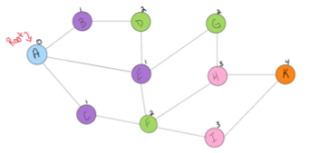
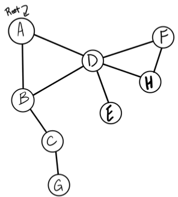

# Notes - Day 29

# Quiz - Day 29

---
## Quiz: Graphs

1. What's a DAG?
2. What is a Digraph?
3. What is a Cyclic Graph?
4. What's a weighted graph?
5. What is a Completed graph?
6. How is an adjacency array represented?
7. What are the methods for traversing through a graph?
8. Explain what a "vertex" is?
9. If you have a standalone node, what it might be called?
10. Graphs are represented in 2 ways, what are they?

---
---

## <a href = "https://codefellows.github.io/common_curriculum/data_structures_and_algorithms/Code_401/class-35/resources/graphs.html">Graphs</a>

A graph is a non-linear data structure that can be looked at as a collection of vertices, or nodes, potentially connected by line segments, named, edges.

### Terminology:

- *Vertex:* A vertex, also called a “node”, is a data object that can have zero or more adjacent vertices.
- *Edge:* An edge is a connection between two nodes.
- *Neighbor:* - The neighbors of a node are its adjacent nodes, i.e., are connected via an edge.
- *Degree:* - The degree of a vertex is the number of edges connected to that vertex.

### Directed vs Undirected

---
**Undirected Graphs**

An Undirected Graph is a graph where each edge is undirected or bi-directional. This means that the undirected graph does not move in any direction.

For example, in the graph below, Node C is connected to Node A, Node E and Node B. There are no “directions” given to point to specific vertices. The connection is bi-directional.

**A &#9135;&#9135; C &#9135;&#9135; B** 
**&nbsp;|&nbsp; &nbsp; &nbsp; &nbsp;|&nbsp; &nbsp; &nbsp; &nbsp;|**  
**D &#9135;&#9135; E &#9135;&#9135; F**

The undirected graph we are looking at has 6 vertices and 7 undirected edges.

- Vertices/Nodes = {A, B, C, D, E, F}
- Edges = {(A,C), (A,D), (B,C), (B,F), (C,E), (D,E), (E,F)}

**Directed Graphs (Digraph)**

A Directed Graph, also called a Digraph, is a graph where every edge is directed. Unlike an undirected graph, a Digraph has direction. Each node is directed at another node with a specific requirement of what node should be referenced next.

Compare the visual below with the undirected graph above. Can you see the difference? The Digraph has arrows pointing to specific nodes.

**A &rarr; C &larr; B** 
**&uarr;&nbsp;&nbsp;&nbsp;&nbsp;&nbsp; &varr; &nbsp; &nbsp;&nbsp;&nbsp;&darr;** 
**D &rarr; E &rarr; F**

The directed graph above has six vertices and eight directed edges.

- Vertices = {A, B, C, D, E, F}

- Edges = {(A,C), (B,C), (B,F), (C,E),(D,A), (D,E) (E,C) (E,F)}

### Complete vs Connected vs Disconnected

---
There are many different types of graphs. This depends on how connected the graphs are to other node/vertices. The three different types are completed, connected, and disconnected.

**Complete Graphs:** A complete graph is when all nodes are connected to all other nodes.

Take a close look at each of the vertices in the graph above. Do you notice that each vertex is actually connected to every other node on the graph? That is what makes it a complete graph.

**Connected:** A connected graph is graph that has all of vertices/nodes have at least one edge.

In the visual above, this looks a lot more than what you are used to seeing. If you look closely at the different vertices of the graph, you will see that each node is connected to at least one other node or vertices. A Tree is a form of a connected graph.

**Disconnected:** A disconnected graph is a graph where some vertices may not have edges.

In the above visual, the disconnected graph shows that some nodes may not always be connected to other nodes or vertices of the graph. It is complelty possible to have standalone nodes or edges (also known as islands) in a graph data structure.

### Acyclic vs Cyclic

---
In addition to undirected and directed graphs, we also have acyclic and cyclic graphs.

**Acyclic Graph:** An acyclic graph is a directed graph without cycles. A cycle is when a node can be traversed through and potentially end up back at itself.

Here is an example of 3 acyclic graphs:

A directed acyclic graph is also called a "DAG". This can also be represented as what we know as a tree.

**Cyclic Graphs:** A Cyclic graph is a graph that has cycles. A cycle is defined as a path of a positive length that starts and ends at the same vertex.

Here is an example of a two different cyclic graph:

### Graph Representation

---
We represent graphs through:

- *Adjacency Matrix*
- *Adjacency List*

We will represent the following graph as both an Adjacency Matrix and an Adjacency List:

**A &#9135;&#9135; C &#9135;&#9135; B**   
**&nbsp;|&nbsp; &nbsp; &nbsp; &nbsp;|&nbsp; &nbsp; &nbsp; &nbsp;|**   
**D &#9135;&#9135; E &#9135;&#9135; F**

**Adjacency Matrix**

An Adjacency matrix is represented through a 2-dimensional array. If there are "n" vertices, then we are looking at an n x n Boolean matrix.

Each Row and column represents each vertex of the data structure. The elements of both the column and the row must add up to 1 if there is an edge that connects the two, or zero if there isn’t a connection.

This is what an adjacency matrix looks like:

<!--  -->

|   |**A**| B | C | D | E |**F**
| - | - | - | - | - | - | -
|**A**| 0 | 0 | 1 | 1 | 0 | 0
|**B**| 0 | 0 | 1 | 0 | 0 | 1
|**C**| 1 | 1 | 0 | 0 | 1 | 0
|**D**| 1 | 0 | 0 | 0 | 1 | 0
|**E**| 0 | 0 | 1 | 1 | 0 | 1
|**F**| 0 | 1 | 0 | 0 | 1 | 0

A few things to note from the above: Looking at the graph we are representing, you can see that Vertex 'A' connects to both Vertex 'D' and Vertex 'C'. To show this, we place a "1" in the position of (A, C) and (A, D).

We follow this same pattern for the other vertex’s and where they are connected. If there is not an edge/connection between the vertex’s, we represent this by placing a "0" in the appropriate point of the matrix.

A sparse graph is when there are very few connections. A dense graph is when there are many connections.

Within an adjacency matrix, an undirected graph will always be symmetric. This is not the case for a directed graph.

**Adjacency List**

An adjacency list is the most common way to represent graphs. An adjacency list is a collection of linked lists or an array that lists all of the other vertices that are connected. Adjacency lists make it easy to view if one vertices connects to another.

This is what an Adjacency List looks like:

<!--  -->

| | |
|-|-|
|**A**| &rarr; C &rarr; D
|**B**| &rarr; C &rarr; F
|**C**| &rarr; A &rarr; B &rarr; E
|**D**| &rarr; A &rarr; E
|**E**| &rarr; C &rarr; D &rarr; F
|**F**| &rarr; B &rarr; E

Looking at the original graph that we are representing, we can see that Vertex 'A' has an edge to both Vertex 'C' and Vertex 'D'. As a result, we will place both Vertex 'C' and Vertex 'D' in the adjacency list. Just from observation, we can see that we will only place the vertices that are connected in the list. If there is no connection between the vertices, they are not listed.

- We can visually see that we are working with a collection of some sort. The visual is depicting a Linked List, but you could easily make it an array of arrays if you’d like.
- Each index or node (depending on the data structure you choose to represent the adjacency list) will be a vertex within the graph.
- Every time you add an edge, you will find the appropriate vertices in the data structure and add it to the appropriate location.

**Weighted Graphs**

A weighted graph is a graph with numbers assigned to its edges. These numbers are called weights.

This is what a weighted graph looks like:

When representing a weighted graph in a matrix, you set the element in the 2D array to represent the actual weight between the two paths. If there is not a connection between the two vertices, you can put a 0, although it is known for some people to put the infinity sign instead.

Using the graph from above, here is an example of what a weight matrix would look like:

<!--  -->

|     |**A**| B | C |**D**
|  -  |  -  | - | - |  -  |
|**A**|  0  | 4 | 3 |  9  |
|**B**|  4  | 0 | 0 |  5  |
|**C**|  3  | 0 | 0 |  6  |
|**D**|  9  | 5 | 6 |  0  |

Within adjacency lists, you must include both the weight and the name of the adjacent vertex.

Here is an example of what this may look like:

<!--  -->

| | |
|-|-|
|**A**| &rarr; B, 4 &rarr; D, 9 &rarr; C, 3
|**B**| &rarr; A, 4 &rarr; D, 5
|**C**| &rarr; A, 3 &rarr; D, 6
|**D**| &rarr; A, 9 &rarr; B, 5 &rarr; C, 6

Do you notice the differences and similarities of a weighted adjacency list vs an unweighted? A great way to represent the {vertices, weight} connection is through some sort of key/value pair data structure.

### Traversals

---
You will be required to traverse through a graph. The traversals itself are like those of trees. Below is a breakdown of how you would traverse a graph.

**Breadth First**

In a breadth first traversal, you are starting at a specific vertex/node. This node must be specified when calling the `BreadthFirst()` method. The breadth-first traversal of a graph is like that of a tree, with the exception that graphs can have cycles. Traversing a graph that has cycles will result in an infinite loop; this is bad. To prevent such behavior, we need to have some way to keep track of whether a vertex has been “visited” before. Upon each visit, we’ll add the previously-unvisited vertex to a `visited` set, so we know not to visit it again as traversal continues.

Breadth first traversal is when you visit all the nodes that are closest to the root as possible. From there you traverse outwards, level by level, until you have visited all the vertices/nodes.

Here is what the algorithm breadth first traversal looks like:

- `Enqueue` the declared start node into the Queue.
- Create a loop that will run while the node still has nodes present.
- `Dequeue` the first node from the queue
- If the `Dequeue`‘d node has unvisited child nodes, add the unvisited children to `visited` set and insert them into the queue.

Let’s look at a visual for a breadth first:

The visual above shows the levels in which the nodes will be added to the queue. You can see that since the root node is 'A', it will look the nodes that are only 1 away from the root. This is 'C', 'E', & 'B'.

Next it will look at the nodes that are 2 away from the root, this is 'F', 'G', & 'D'. It will follow this pattern until it reaches the end of the graph and all nodes have been visited. This is the code for a breadth first traversal:

~~~js
ALGORITHM BreadthFirst(vertex)
    DECLARE nodes <-- new List()
    DECLARE breadth <-- new Queue()
    DECLARE visited <-- new Set()

    breadth.Enqueue(vertex)
    visited.Add(vertex)

    while (breadth is not empty)
        DECLARE front <-- breadth.Dequeue()
        nodes.Add(front)

        for each child in front.Children
            if(child is not visited)
                visited.Add(child)
                breadth.Enqueue(child)   

    return nodes;
~~~

Here is a breakdown of what is going on:

- We have declared that our starting node (or root) is going to be `Node A`.
- The first thing we want to do is `Enqueue` the root.
- We also need to add the root to the `visited` set.
- Next, we enter a while loop. We want this loop to keep running until there are no more nodes in our queue.
- Once we are in the while loop, we want to `Dequeue` the front node and then check to see if it has any children.
- If there are children of the node we are currently looking at, we want to add them to `visited` set. This will help us know that we have already seen that node before, and won’t accidently push us into an infinite loop if the graph was cyclic. In addition to tracking each child node as visited, we want to place any of its children that have not yet been visited into the queue.
- The process will complete until the queue is empty.
- Once the while loop breaks, we can then return the list of nodes. This list will contain, in order, all the nodes that were traversed.

A few things to note about breadth-first traversals:

- If there are any disconnected nodes (such as islands) with the graph data structure, they will not be traversed.
- Breadth-first only outputs the nodes that are connected in some relation to the root that you pass in.

**Depth First**

In a depth first traversal, we approach it a bit different than the way we do when working with a depth first traversal of a tree. Similar to how the breadth-first uses a queue, we are going to use a Stack for our depth-first traversal.

The algorithm for a depth first traversal is as follows:

- `Push` the root node into the stack
- Start a while loop while the stack is not empty
- `Peek` at the top node in the stack
- If the top node has unvisited children, mark the top node as visited, and then `Push` any unvisited children back into the stack.
- If the top node does not have any unvisited children, `Pop` that node off the stack
- Repeat until the stack is empty.

Let’s look at the visual for a depth-first traversal.

We will conduct a depth-first traversal on this graph:

- The first thing that we are going to do is look at the root. Following the algorithm we described above, we want to look at all of `Node A`’s children (`Node B` and `Node D`). Since `Node B` is first, we notice that it has not yet been visited, it then gets `Pushed` into the stack.
- Before looking at the rest of `Node A`’s children, we will look at the children of Node `B`. and start visiting children that haven’t yet been visited.
- `Node C` then gets `Pushed` into the stack.
- By the time we hit `Node G`, This is the state of our data structure:

- Moving back up the graph, we slowly `Pop` off the stack until we reach a child node that has not yet been visited. This just so happens to be `Node D`, since it is connected to `Node B`.
- The algorithm keeps running and once we hit `Node E`, this is the state of our program:

- Notice how `Node D` has 3 children. We already visited `Node E`, so we move onto `Node H`.

- Finally, we can see that `Node H` has a child, so we can wrap up the traversal by visiting `Node F`.

- `Node F` gets popped off the stack since it has no children
All three of the children of `Node D` have been visited so it also gets `Pop`‘d off the stack
Finally, `Node A` gets popped off the stack to complete the algorithm.

### Real World Uses of Graphs

---
Graphs are extremely popular when it comes to it’s uses. Here are just a few examples of graphs in use:

- GPS and Mapping
- Driving Directions
- Social Networks
- Airline Traffic
- Netflix uses graphs for suggestions of products

---
<a href = "https://github.com/scottie-l/reading-notes/tree/main/reading-notes-401">Back</a>

---
